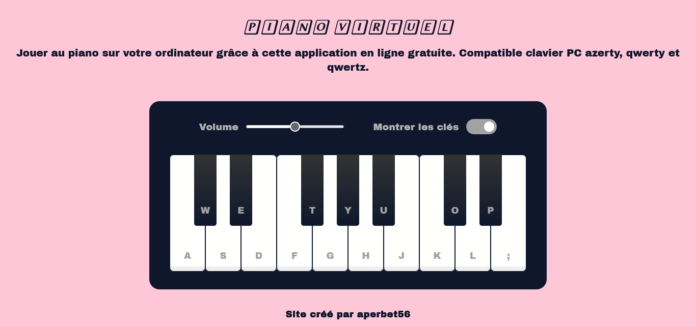

## PIANO VIRTUEL 🎹

## Le challenge

Construction d'un piano virtuel en HTLM5 , CSS3 et JavaScript permettant de jouer des airs simples.

## Démonstrtion

Lien vers le projet : https://aperbet56.github.io/playable_piano/

## Développez avec

- Utilisation des balises sémantiques HTML5
- CSS
- Flexbox
- Page web responsive
- Utilisation d'un normaliseur : le fichier normalize.css
- JavaScript
- Code JavaScript commenté
- Desktop first
- Importation des polices "Archivo Black" et "Libertinus Keyboard"
